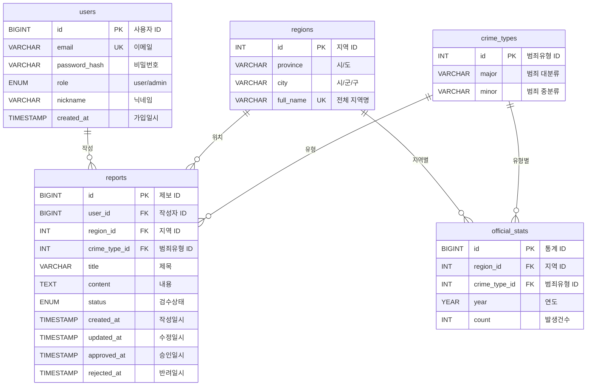

# aws13th-team1-crime

# 1. 서비스 기획안

## 1. 1서비스 개요

- **서비스 한 줄 소개**: 로그인한 사용자가 공공데이터 기반 지역별 범죄 통계를 조회하고, 피해 제보 게시판에 경험을 카테고리/지역과 함께 작성하면 관리자가 검수 후 범죄 이력(Report) DB에 반영하는 서비스

### 핵심 가치

1. **공식 통계 조회**로 객관적 기준 제공
2. **피해 제보 게시판**으로 체감 정보 수집(카테고리 기반)
3. **관리자 검수 후 반영**으로 신뢰도 확보

---

## 1. 2 역할/권한(로그인 필수)

- **회원(User)**
    - 통계 조회(전체 기능)
    - 피해 제보 게시글 작성/조회/수정/삭
- **관리자(Admin)**
    - 피해 제보 게시글 검수
    - 게시글 기반 Report 생성/승인/반려

---

## 1. 3 주요 기능 범위

### 통계 조회(공공데이터)

- 필터: 지역(시/군/구), 범죄 카테고리(대/중분류), 연도(또는 제공 범위)
- 결과: 공식 통계 수치 표시

---

### 피해 제보 게시판

**목적**: “이력으로 반영 가능한 제보”를 받는 공간

- 글 작성 필수 입력
    - **카테고리(필수)**: 범죄유형(대/중분류)
    - **지역(필수)**: 시/군/구 단위
    - **본문(필수)**: 피해 경험 서술
- 기능
    - 목록/상세/작성/수정/삭제(작성자만)
    - 필터: 지역/카테고리/정렬(최신 등)

---

### 관리자 검수 → 이력 반영(Report)

- 관리자는 “피해 제보 게시판 글” 을 보고 `status` 컬럼 반영할지 결정
- 흐름
    1. 제보 글 확인
    2. 승인(approved) 또는 반려(rejected)
    3. 데이터 베이스 업데이트

---

## 1. 4. 핵심 사용자 시나리오

### (A) 통계 조회

1. 로그인 → 지역/카테고리/연도 선택 → 통계 확인(official/merged)

### (B) 피해 제보 작성

1. 로그인 → 피해 제보 게시판 글쓰기 → 카테고리/지역 선택 + 본문 작성 → 등록

### (C) 관리자 반영

1. 관리자 로그인 → 제보 글 검수 → 승인 시 merged 반영

---

## 1. 5. 화면 구성(간단 - 추후 구성)

1. 로그인/회원가입
2. 통계 조회 페이지
3. 피해 제보 게시판(목록/상세/작성)
4. 관리자 페이지(승인·반려)

---

# 2. DB 스키마 설계

### 2.1 ERD 개요

```
users (1) ----< (N) reports
regions (1) ----< (N) reports
crime_types (1) ----< (N) reports
regions (1) ----< (N) official_stats
crime_types (1) ----< (N) official_stats

```

### 2.2 테이블 상세 설계

### 2.2.1 users (사용자 테이블)

사용자 인증 및 권한 관리를 위한 테이블입니다.

| 컬럼명 | 타입 | 제약조건 | 설명 |
| --- | --- | --- | --- |
| id | BIGINT | PRIMARY KEY, AUTO_INCREMENT | 사용자 고유 ID |
| email | VARCHAR(255) | UNIQUE, NOT NULL | 이메일 (로그인 ID) |
| password_hash | VARCHAR(255) | NOT NULL | 암호화된 비밀번호 |
| role | ENUM('user', 'admin') | NOT NULL, DEFAULT 'user' | 사용자 권한 |
| nickname | VARCHAR(50) | NOT NULL | 닉네임 |
| created_at | TIMESTAMP | DEFAULT CURRENT_TIMESTAMP | 가입 일시 |
| google_id UK | VARCHAR | NOT NULL | Google 고유 ID |
| auth_provider | VARCHAR | NOT NULL | local/google |

```sql
CREATE TABLE users (
    id BIGINT PRIMARY KEY AUTO_INCREMENT,
    email VARCHAR(255) UNIQUE NOT NULL,
    password_hash VARCHAR(255) NULL,
    role ENUM('user', 'admin') NOT NULL DEFAULT 'user',
    nickname VARCHAR(50) NOT NULL,
    google_id VARCHAR(255) UNIQUE NULL,
    auth_provider VARCHAR(20) NOT NULL DEFAULT 'local',
    created_at TIMESTAMP DEFAULT CURRENT_TIMESTAMP,
    INDEX idx_email (email),
    INDEX idx_role (role),
    INDEX idx_google_id (google_id),
    INDEX idx_auth_provider (auth_provider)
);

```

### 2.2.2 regions (지역 테이블)

범죄 통계 및 제보의 지역 정보를 관리하는 테이블입니다.

| 컬럼명 | 타입 | 제약조건 | 설명 |
| --- | --- | --- | --- |
| id | INT | PRIMARY KEY, AUTO_INCREMENT | 지역 고유 ID |
| province | VARCHAR(50) | NOT NULL | 시/도 (예: 서울, 부산, 경기도) |
| city | VARCHAR(50) | NULL | 시/군/구 (예: 종로구, 중구, 고양시) |
| full_name | VARCHAR(100) | UNIQUE, NOT NULL | 전체 지역명 (예: 서울 종로구) |

```sql
CREATE TABLE regions (
    id INT PRIMARY KEY AUTO_INCREMENT,
    province VARCHAR(50) NOT NULL,
    city VARCHAR(50) NULL,
    full_name VARCHAR(100) UNIQUE NOT NULL,
    INDEX idx_province (province),
    INDEX idx_full_name (full_name)
);

```

**데이터 예시:**

- `id=1, province='서울', city='종로구', full_name='서울 종로구'`
- `id=2, province='서울', city='중구', full_name='서울 중구'`
- `id=3, province='부산', city='중구', full_name='부산 중구'`
- `id=4, province='경기도', city='고양시', full_name='경기도 고양시'`

### 2.2.3 crime_types (범죄 유형 테이블)

범죄 대분류와 중분류를 관리하는 테이블입니다.

| 컬럼명 | 타입 | 제약조건 | 설명 |
| --- | --- | --- | --- |
| id | INT | PRIMARY KEY, AUTO_INCREMENT | 범죄 유형 고유 ID |
| major | VARCHAR(50) | NOT NULL | 범죄 대분류 (예: 강력범죄, 절도범죄) |
| minor | VARCHAR(50) | NULL | 범죄 중분류 (예: 살인기수, 강도) |

```sql
CREATE TABLE crime_types (
    id INT PRIMARY KEY AUTO_INCREMENT,
    major VARCHAR(50) NOT NULL,
    minor VARCHAR(50) NULL,
    UNIQUE KEY unique_crime_type (major, minor),
    INDEX idx_major (major)
);

```

**데이터 예시:**

- `id=1, major='강력범죄', minor='살인기수'`
- `id=2, major='강력범죄', minor='살인미수등'`
- `id=3, major='강력범죄', minor='강도'`
- `id=4, major='절도범죄', minor=NULL` (합계 데이터용)

**CSV 데이터 기반 범죄 대분류:**

- 강력범죄, 절도범죄, 폭력범죄, 지능범죄, 풍속범죄
- 특별경제범죄, 마약범죄, 보건범죄, 환경범죄, 교통범죄
- 노동범죄, 안보범죄, 선거범죄, 병역범죄, 기타범죄

**CSV 데이터 기반 범죄 중분류 (일부):**

- 강력범죄: 살인기수, 살인미수등, 강도, 강간, 유사강간, 강제추행, 기타 강간/강제추행등, 방화
- 절도범죄: 절도범죄
- 폭력범죄: 상해, 폭행, 체포감금, 협박, 약취유인, 폭력행위등, 손괴
- 기타 등

### 2.2.4 official_stats (공식 통계 테이블)

경찰청 공공데이터 기반의 공식 범죄 통계를 저장하는 테이블입니다.

| 컬럼명 | 타입 | 제약조건 | 설명 |
| --- | --- | --- | --- |
| id | BIGINT | PRIMARY KEY, AUTO_INCREMENT | 통계 고유 ID |
| region_id | INT | FOREIGN KEY → regions.id, NOT NULL | 지역 ID |
| crime_type_id | INT | FOREIGN KEY → crime_types.id, NULL | 범죄 유형 ID (NULL: 합계) |
| year | YEAR | NOT NULL | 통계 연도 |
| count | INT | NOT NULL, DEFAULT 0 | 발생 건수 |

```sql
CREATE TABLE official_stats (
    id BIGINT PRIMARY KEY AUTO_INCREMENT,
    region_id INT NOT NULL,
    crime_type_id INT NULL,
    year YEAR NOT NULL,
    count INT NOT NULL DEFAULT 0,
    FOREIGN KEY (region_id) REFERENCES regions(id) ON DELETE CASCADE,
    FOREIGN KEY (crime_type_id) REFERENCES crime_types(id) ON DELETE CASCADE,
    UNIQUE KEY unique_stat (region_id, crime_type_id, year),
    INDEX idx_region_year (region_id, year),
    INDEX idx_crime_type (crime_type_id),
    INDEX idx_year (year)
);

```

**데이터 예시:**

```sql
-- 서울 종로구의 2024년 강력범죄-살인기수 통계
INSERT INTO official_stats (region_id, crime_type_id, year, count)
VALUES (1, 1, 2024, 0);

-- 서울 종로구의 2024년 강력범죄 전체 합계 (crime_type_id=NULL)
INSERT INTO official_stats (region_id, crime_type_id, year, count)
VALUES (1, NULL, 2024, 100);

```

### 2.2.5 reports (피해 제보 게시판 테이블)

사용자 제보와 관리자 검수 상태를 통합 관리하는 테이블입니다.

| 컬럼명 | 타입 | 제약조건 | 설명 |
| --- | --- | --- | --- |
| id | BIGINT | PRIMARY KEY, AUTO_INCREMENT | 제보 고유 ID |
| user_id | BIGINT | FOREIGN KEY → users.id, NOT NULL | 작성자 ID |
| region_id | INT | FOREIGN KEY → regions.id, NOT NULL | 지역 ID |
| crime_type_id | INT | FOREIGN KEY → crime_types.id, NOT NULL | 범죄 유형 ID |
| title | VARCHAR(200) | NOT NULL | 제목 |
| content | TEXT | NOT NULL | 본문 내용 |
| status | ENUM('pending', 'approved', 'rejected') | NOT NULL, DEFAULT 'pending' | 검수 상태 |
| created_at | TIMESTAMP | DEFAULT CURRENT_TIMESTAMP | 작성 일시 |
| updated_at | TIMESTAMP | DEFAULT CURRENT_TIMESTAMP ON UPDATE CURRENT_TIMESTAMP | 수정 일시 |
| approved_at | TIMESTAMP | NULL | 승인 일시 |
| rejected_at | TIMESTAMP | NULL | 반려 일시 |

```sql
CREATE TABLE reports (
    id BIGINT PRIMARY KEY AUTO_INCREMENT,
    user_id BIGINT NOT NULL,
    region_id INT NOT NULL,
    crime_type_id INT NOT NULL,
    title VARCHAR(200) NOT NULL,
    content TEXT NOT NULL,
    status ENUM('pending', 'approved', 'rejected') NOT NULL DEFAULT 'pending',
    created_at TIMESTAMP DEFAULT CURRENT_TIMESTAMP,
    updated_at TIMESTAMP DEFAULT CURRENT_TIMESTAMP ON UPDATE CURRENT_TIMESTAMP,
    approved_at TIMESTAMP NULL,
    rejected_at TIMESTAMP NULL,
    FOREIGN KEY (user_id) REFERENCES users(id) ON DELETE CASCADE,
    FOREIGN KEY (region_id) REFERENCES regions(id) ON DELETE RESTRICT,
    FOREIGN KEY (crime_type_id) REFERENCES crime_types(id) ON DELETE RESTRICT,
    INDEX idx_user (user_id),
    INDEX idx_region (region_id),
    INDEX idx_crime_type (crime_type_id),
    INDEX idx_status (status),
    INDEX idx_created_at (created_at DESC)
);

```

**상태(status) 설명:**

- `pending`: 검수 대기 중 (기본값)
- `approved`: 관리자 승인 완료
- `rejected`: 관리자 반려

# 3. ERD (Entity Relationship Diagram)



# 4. API 엔드포인트 요약

### 인증 API

- `POST /api/auth/register` - 회원가입
- `POST /api/auth/login` - 로그인
- `POST /api/auth/logout` - 로그아웃

### 통계 조회 API

- `GET /api/stats?region_id={}&major={}&year={}` - 공식 통계 조회
- `GET /api/regions` - 지역 목록
- `GET /api/crime-types` - 범죄 유형 목록

### 피해 제보 API

- `GET /api/reports` - 제보 목록 (필터링/페이징)
- `GET /api/reports/:id` - 제보 상세
- `POST /api/reports` - 제보 작성
- `PUT /api/reports/:id` - 제보 수정
- `DELETE /api/reports/:id` - 제보 삭제

### 관리자 검수 API

- `GET /api/admin/reports` - 검수 대기 목록
- `POST /api/admin/reports/:id/approve` - 제보 승인
- `POST /api/admin/reports/:id/reject` - 제보 반려
